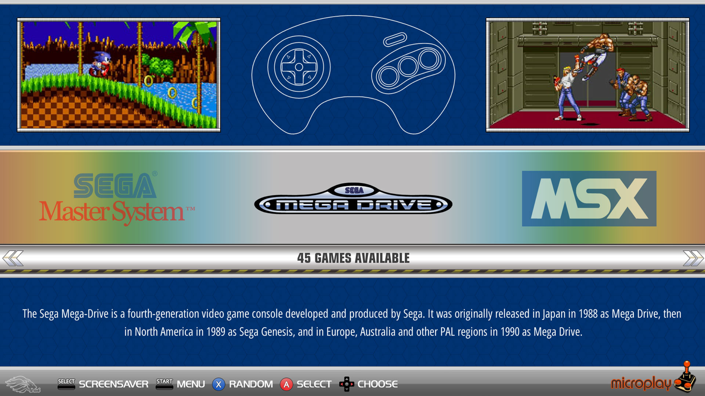
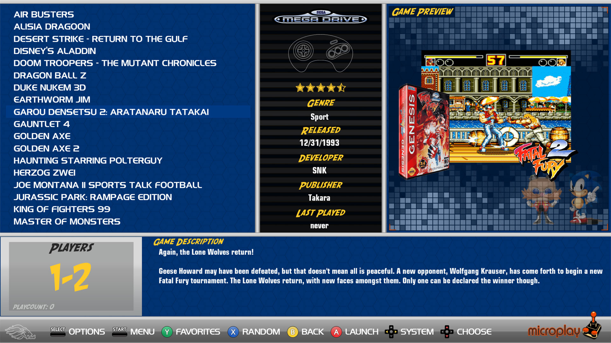
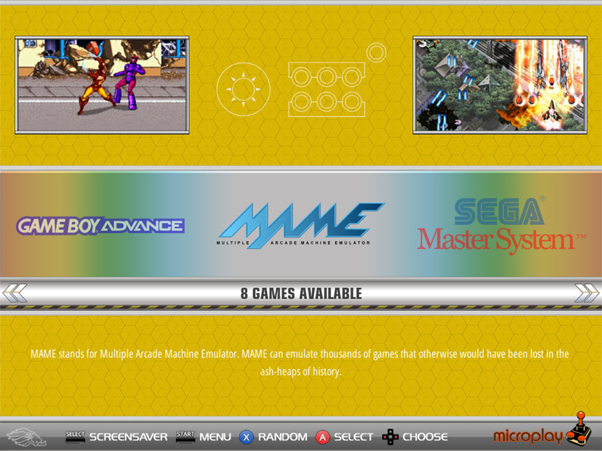
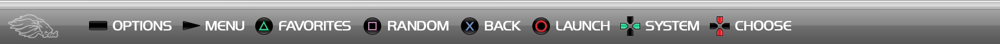
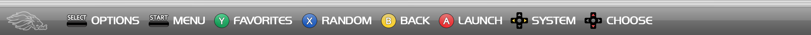
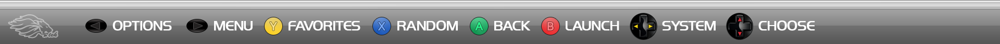
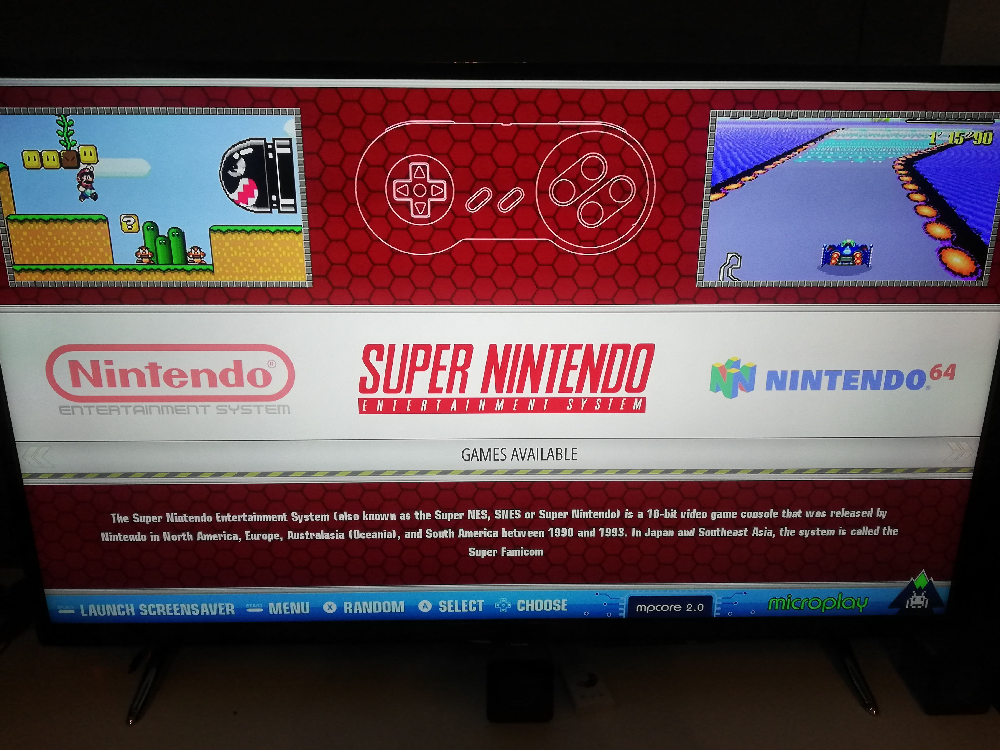
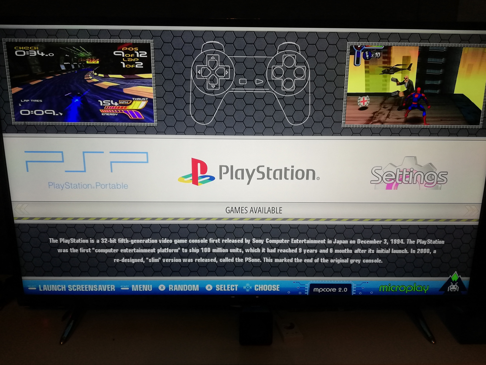

# MPCORE-NXT - Imagebase - ES-System
 

# MPCORE-NXT - 16:9 - 1080p
 

# MPCORE-NXT - 4:3 - 1024x768
 

# MPCORE-NXT - changeable Helpsystem for many Controllers types
 
 
 
![pic008]ES-Helpsystem_xone_detail.png "ES-Helpsystem Xbox-One") 

   

# MPCORE-2 (Legacy Version 2018)

